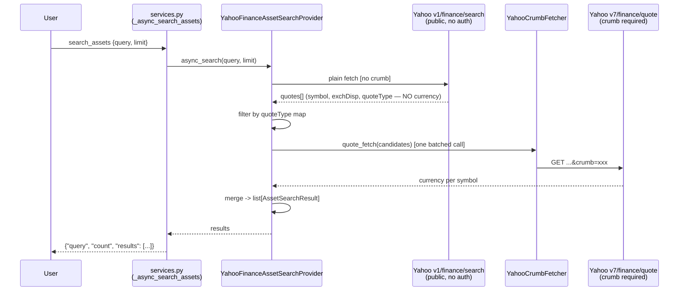
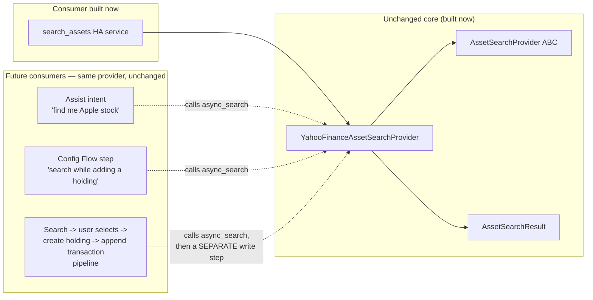

# MILESTONE_11_DESIGN.md — Asset Discovery

Design pass before implementation, matching `MILESTONE_7_DESIGN.md`'s scope — a scoping/decision document, not a spec on the scale of `MILESTONE_4_SPEC.md`.

## Starting position

Creating a `holdings.yaml` entry requires already knowing the exact Yahoo Finance ticker (`IWDA.AS`, `VWCE.DE`, `AAPL`) — not user-friendly for anyone who knows a company or fund by name, not by its exchange-qualified symbol. This milestone adds a reusable Asset Discovery layer: search by name, get back candidate tickers with exchange/currency/asset type, so a user can find the right symbol before ever touching `holdings.yaml`.

## Verified API contract (not assumed)

Before designing anything, the actual Yahoo Finance search API was checked live:

- `https://query1.finance.yahoo.com/v1/finance/search?q={query}&quotesCount={n}&newsCount=0` is **public — no crumb/cookie auth needed**, confirmed by calling it directly with none sent. Returns `{"quotes": [...]}`, each with `symbol`, `shortname`/`longname`, `exchange` (raw code, e.g. `"GER"`), `exchDisp` (human-readable, e.g. `"XETRA"`, `"NASDAQ"`, `"Amsterdam"`), `quoteType` (`"EQUITY"`, `"ETF"`, `"MUTUALFUND"`, `"CRYPTOCURRENCY"`, plus others not supported here).
- Searching "vanguard ftse all-world" returned `VWCE.DE` / `GER` / `XETRA` / `ETF` at the top — matching the worked example from the original spec exactly.
- **Search results carry no `currency` field anywhere** — confirmed absent across every result checked. Currency has to come from a second call to the existing `v7/finance/quote` endpoint (the one `YahooFinanceProvider` already uses), which *does* require the crumb per the v1.0.1 fix, and does return `currency` per symbol (confirmed by `providers/yahoo_finance.py` already parsing `item.get("currency", "USD")` from that exact response shape).

This one fact — search has no currency, quote has no name/exchange-by-itself-useful-for-search — is why the whole design is a two-call flow, not a single lookup.

## The two-call flow

```
providers/asset_search_base.py
  AssetSearchResult (dataclass): symbol, name, exchange, currency, asset_type
  AssetSearchProvider (ABC): async_search(query, limit) -> list[AssetSearchResult]

providers/yahoo_finance_asset_search.py
  YahooFinanceAssetSearchProvider(search_fetch: FetchFn, quote_fetch: FetchFn)
```

1. `search_fetch(SEARCH_URL)` — plain, unauthenticated call to `v1/finance/search`.
2. Filter `quotes[]` by `quoteType` against a closed map (see below); build candidates with `symbol`, `name` (longname → shortname → symbol fallback), `exchange` (exchDisp → exchange fallback), `asset_type`.
3. Batch every surviving candidate symbol into **one** `quote_fetch(QUOTE_URL)` call (crumb-authenticated) for `currency` — same batching discipline `YahooFinanceCurrencyProvider` already uses (N candidates, one HTTP round trip).
4. Merge. A candidate with no currency in the enrichment response is dropped silently — matches the existing "malformed/missing item skipped, not raised" convention every other provider follows.



## The `quoteType` mapping table

| Yahoo `quoteType` | This project's `asset_type` |
|---|---|
| `EQUITY` | `stock` |
| `ETF` | `etf` |
| `MUTUALFUND` | `mutual_fund` |
| `CRYPTOCURRENCY` | `crypto` |
| everything else (`INDEX`, `FUTURE`, `OPTION`, `CURRENCY`, ...) | filtered out, not an error |

A closed, explicit map, not a passthrough of whatever string Yahoo sends — `Holding.type` (`engine/models.py`) has no home yet for anything outside the four supported types, and this project's own convention (confirmed by grep — no asset-type enum exists anywhere) treats `type` as a free string with an informal, test-fixture-established vocabulary. Filtering unsupported types is routine, expected behavior, not a malformed-input error path.

## Why a third provider category

`PriceProvider` answers "what is this instrument worth," `CurrencyProvider` answers "how do two currencies compare" (ADR-0002). `AssetSearchProvider` answers a third, independent question — "what could this query mean" — and gets its own small ABC with no inheritance from either sibling, per ADR-0002's own precedent. `providers/asset_search_base.py` mirrors `price_base.py`/`currency_base.py` exactly: one `@abstractmethod` business method, one `name` property, `ABC`-based, no `Protocol`.

## Why `AssetSearchResult` isn't in `engine/models.py`

`Quote` lives in `engine/models.py` because it's consumed by core calculation code (`build_positions`, every calculator) independent of which provider produced it. `AssetSearchResult` has no such consumer — it never flows into a `Portfolio`, never touches a `Calculator`, never reaches `PortfolioEngine.run()`. It's produced and consumed entirely at the discovery/service boundary, so it lives in `providers/asset_search_base.py`, co-located with the ABC that returns it. This placement matches the same core-engine-vs-sibling-capability boundary the versioning decision below draws.

## The plain-fetch/crumb-fetch split

See **ADR-0014** for the full reasoning: `YahooFinanceAssetSearchProvider` takes two independently-injected `FetchFn`s rather than one, since its two calls have genuinely different auth requirements. The same ADR also covers why `AssetSearchResult` carries no raw Yahoo-specific fields (`quoteType`, raw exchange code) — debugging visibility comes from `_LOGGER.debug(...)` inside the provider instead, not from polluting the return type.

## Provider creation and selection

No factory/registry exists anywhere in this codebase for `PriceProvider`/`CurrencyProvider` — `coordinator.py` directly constructs `YahooFinanceProvider(...)`, since exactly one concrete implementation has ever existed. `search_assets` follows the same precedent: `_async_search_assets` directly constructs a fresh `YahooFinanceAssetSearchProvider(...)` per call, matching `import_transactions` constructing a fresh importer instance per call rather than a cached singleton. The ABC exists so a second implementation could be swapped in later — no selection mechanism (a `_PROVIDERS`-style dict, like `import_transactions` has for broker formats) is built now, since there's no second implementation and no requirement for one yet.

## Vendored-copy synchronization

`providers/` has a vendored copy under `custom_components/portfolio_engine/providers/`, kept in sync entirely by manual convention today — a real, acknowledged risk (nothing mechanically prevents drift). This milestone adds `tests/test_vendored_copy_sync.py`, which walks `providers/`/`engine/`/`repositories/` and asserts every file matches its vendored counterpart byte-for-byte except the one known import-line substitution (`from engine.` → `from ..engine.`). Writing this test surfaced two genuine, pre-existing drifts (a stray missing blank line in `providers/yahoo_finance.py` and `repositories/yaml_repository.py`'s vendored copies) — both fixed as part of this milestone, proving the test's value immediately.

## HA service design

`portfolio_engine.search_assets` — domain-wide, not portfolio-scoped (no `_find_coordinator_for_portfolio` lookup, unlike `import_transactions`/`export_portfolio_data`). Schema: `query` (required string), `limit` (optional int, default 10, range 1–25). Registered/deregistered following the exact same `has_service`-guarded, domain-level lifecycle the other two services use. Never writes anything — an empty `results: []` is a valid response, not an error, since searching is allowed to legitimately find nothing.

## Phase 3 — future extensibility (design-only, not built now)



None of the three future consumers require any change to `AssetSearchProvider`/`AssetSearchResult`/`YahooFinanceAssetSearchProvider` — they're pure new callers. The eventual "create holding + append transaction" pipeline is explicitly a separate, future write-service — the same deliberate gap already established between `import_transactions`'s report-only behavior today and a hypothetical future "apply the import" service.

## Testing plan

- **Unit** (`tests/test_asset_search_provider.py`): fake `search_fetch`/`quote_fetch` closures — empty query/non-positive limit short-circuits both fetches; all four supported `quoteType`s map correctly; unsupported types filtered before the quote call fires; batching; missing-currency candidate dropped not raised; malformed item skipped; name/exchange fallback chains; empty search results skip the quote call; two "real worked example" tests (Apple, Vanguard) using the actually-verified live response shapes as direct proof the feature does what the spec asked.
- **Integration** (`tests_integration/test_yahoo_asset_search_wiring.py`): using the same `FakeSession`/`FakeResponse` pattern as `test_yahoo_auth.py` — proves the search leg carries no `&crumb=`, the quote leg does, and the crumb is fetched at most once per `async_search()` call.
- **Sync guard** (`tests/test_vendored_copy_sync.py`): every standalone file in `providers/`/`engine/`/`repositories/` has a content-identical vendored counterpart.
- **Real HA harness** (`tests_ha/test_asset_search_ha.py`): service registered/deregistered on entry setup/last-unload; mocked-provider call returns expected shape; default `limit=10` applied end-to-end; no portfolio-existence check (unlike the other two services); and an explicit before/after file-content check proving the "no side effects" guarantee, not just a doc claim.

All tiers use only recorded/hardcoded fixtures frozen from the live-verified response shapes — zero live network calls in the automated suite, matching every existing Yahoo-related test in this project.

## Acceptance criteria

- [x] `AssetSearchProvider`/`AssetSearchResult` exist, HA-independent, no engine/calculator coupling.
- [x] `YahooFinanceAssetSearchProvider` implements the two-call flow with the verified real API contract.
- [x] `portfolio_engine.search_assets` service registered, documented in `services.yaml`, domain-wide.
- [x] No portfolio file ever read or written by this feature.
- [x] No hardcoded exchange list — `exchange` is whatever Yahoo returns, verbatim (via `exchDisp`).
- [x] No HTML scraping — both calls are the same JSON APIs the rest of this project already uses.
- [x] Engine version unchanged (`1.0.0`); integration version bumped to `1.1.0`.
- [x] Vendored copy kept in sync, now mechanically verified.
