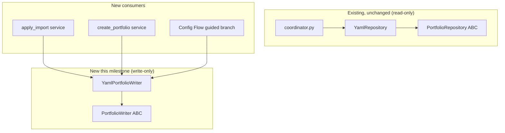
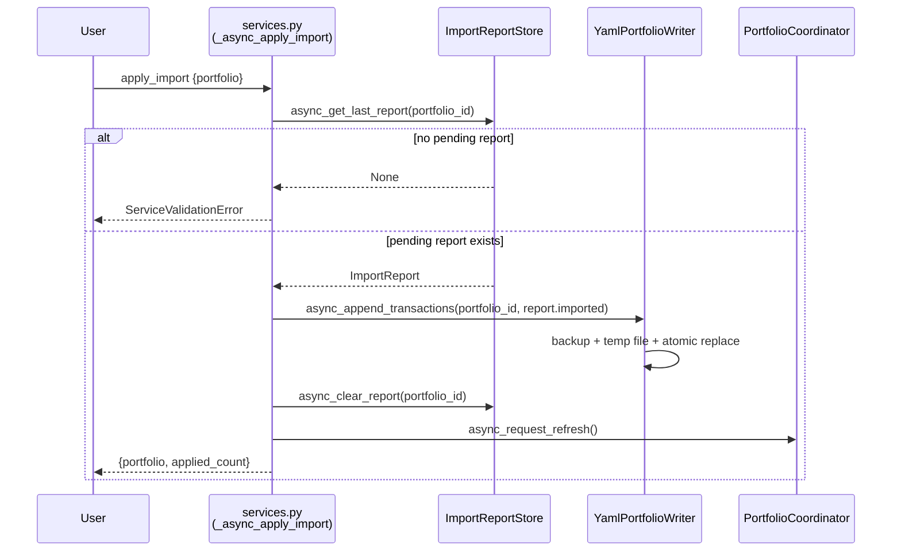
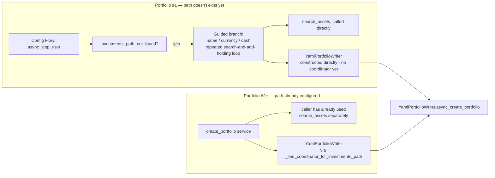

# MILESTONE_12_DESIGN.md — Portfolio Import & Assisted Setup

Design pass before implementation, matching `MILESTONE_11_DESIGN.md`'s and `MILESTONE_7_DESIGN.md`'s scope — a scoping/decision document, not a spec on the scale of `MILESTONE_4_SPEC.md`. **No code has been written for this milestone.** This document and ADR-0015 through ADR-0018 are the proposal; nothing here is implemented until it's approved.

## Starting position

Three independent threads already in this codebase point at the same, never-yet-built convergence point:

1. **Milestone 9's import service produces a report but refuses to write.** `import_transactions` parses a broker file into an `ImportReport` and stores it, but `importers/report.py`'s own docstring, `docs/user/BROKER_IMPORT.md`, and `MILESTONE_9.md`'s "what's next" section all say the same thing: turning a reviewed report into actual `transactions.yaml` rows is a deliberate manual step today, flagged at the time as needing "its own careful design."
2. **Milestone 11's asset search explicitly diagrams an unbuilt pipeline.** `MILESTONE_11_DESIGN.md`'s "Phase 3 — future extensibility" section draws exactly this: `search -> user selects -> create holding -> append transaction`, built on an `AssetSearchProvider` that "requires no change" for any of these future consumers.
3. **Nothing in this codebase can write to `holdings.yaml`/`transactions.yaml` today.** `PortfolioRepository`/`YamlRepository` are read-only by design (confirmed: zero `.write_text(` calls anywhere in `yaml_repository.py`), and Config Flow only ever points at a folder the user has already hand-populated — it never creates one.

Milestone 12 joins these three threads: **Portfolio Import** (turning a reviewed `ImportReport` into real transactions) and **Assisted Setup** (using `search_assets` to help a user create a new portfolio without hand-writing YAML first).

## Scope for this milestone

**In scope:**
- A new write-capable interface (`PortfolioWriter`/`YamlPortfolioWriter`) and a safe file-write mechanism, since neither exists today.
- `portfolio_engine.apply_import` — applies the currently-pending `ImportReport` for a portfolio.
- `portfolio_engine.create_portfolio` — creates a brand-new portfolio (optionally pre-populated with holdings) under an already-configured investments path.
- A Config Flow guided branch that turns today's `investments_path_not_found` dead end into a working first-portfolio setup flow.

**Explicitly out of scope for this milestone** (see each ADR's "Alternatives Considered" for the reasoning):
- Selective/partial import apply (choosing individual rows) — all-or-nothing only.
- Editing an existing portfolio's holdings after creation (no "upsert," no "add a holding to an existing portfolio" service).
- A Config-Flow-based wizard for portfolios after the first one under a given path.
- Any change to `import_transactions`, `search_assets`, `engine/models.py`, or any calculator.

## Portfolio Identity Model

Both new services need a precise, unambiguous answer to "which portfolio is this," so this is worth stating explicitly rather than leaving implicit — especially since `create_portfolio` has to mint a *new* identity, not just look one up.

**Identity is filename-based, not metadata-based.** A portfolio's id is the name of its immediate subdirectory under an investments path — confirmed in `YamlRepository.async_get_portfolios()`, which sets `portfolio_id = portfolio_dir.name` directly from the filesystem, never from anything inside `holdings.yaml`. The `name:` field inside `holdings.yaml` is a separate, purely cosmetic display label (used for entity friendly names) — it is never read as an identifier anywhere in this codebase, two portfolios could even share the same `name:` without conflict, and changing it never changes which portfolio is which. `create_portfolio` (ADR-0018) follows this exactly: its `portfolio_id` parameter *is* the directory name it creates; `name` is stored only as that cosmetic field.

**`transactions.yaml` doesn't declare its own portfolio at all.** Confirmed in `YamlRepository._load_transactions`: the file's own entries carry no `portfolio_id` field — `Transaction.portfolio_id` is filled in by the repository from the parent directory's name as it reads, purely positional/implicit. A `transactions.yaml` file's identity is entirely "whichever folder it happens to sit in."

**Within one investments path, portfolios are addressed by this directory-name string alone.** `import_transactions`/`export_portfolio_data`/`search_assets`'s sibling services already take a plain `portfolio` string for exactly this reason, and `apply_import` (ADR-0017) does the same.

**Across multiple investments paths (multiple config entries), this is where an existing ambiguity lives — not introduced by this milestone, but inherited by it.** `_find_coordinator_for_portfolio(hass, portfolio_id)` (used by `import_transactions`, `export_portfolio_data`, and now `apply_import`) iterates *every* registered coordinator across *every* config entry and returns the first one whose `portfolio_id` matches — there is no tie-break if two different investments paths each happen to contain a same-named portfolio subdirectory (e.g. two entries both have a `demo_portfolio` folder). This is pre-existing behavior (Milestone 9), not something this milestone changes — fixing it would mean altering a lookup helper three existing services already depend on, which is exactly the kind of existing-architecture change this milestone's own instructions say to avoid absent a production issue. `apply_import` simply inherits the same, already-accepted risk `import_transactions`/`export_portfolio_data` carry today. In practice this only matters if a user names two portfolio folders identically across two separate investments paths, which nothing in this project has ever encouraged.

**`create_portfolio` sidesteps this ambiguity by construction, not by fixing it.** Because the target portfolio doesn't exist in any coordinator's data yet, `_find_coordinator_for_portfolio` couldn't resolve it even if it were unambiguous — so ADR-0018 resolves `create_portfolio` by `investments_path` instead (a new `_find_coordinator_for_investments_path` helper, matching a config entry's own `CONF_INVESTMENTS_PATH` exactly). This is a fully-disambiguated lookup already, one investments path always corresponds to exactly one config entry (Milestone 10's uniqueness rule) — it just happens to also be immune to the same-name-across-paths ambiguity above, as a side effect of being scoped one level higher.

**Import reports reference a portfolio with the same directory-name string, plus an implicit second key.** `ImportReport.portfolio_id` (`importers/report.py`) is that same plain string. But `ImportReportStore` (`import_report_store.py`) is instantiated per config entry — one Store file per `entry_id`, holding a `{portfolio_id: report}` dict inside it — so on disk a report's true key is really the pair *(entry_id, portfolio_id)*, even though the `ImportReport` object itself only carries the second half. `apply_import` inherits this scoping for free: it reads via `coordinator.import_report_store.async_get_last_report(portfolio_id)`, where `coordinator` was already resolved (with the same pre-existing ambiguity noted above) before the report lookup ever happens.

## Architecture — the shared write foundation



`PortfolioWriter` is a new, separate ABC (ADR-0015) — never added to `PortfolioRepository` — so every existing reader of portfolio data (the coordinator, every calculator, `export_portfolio_data`) keeps its "no side effects" guarantee without re-auditing. `YamlPortfolioWriter` is the only concrete implementation for now, matching the "one implementation, still gets its own ABC" precedent `PriceProvider`/`CurrencyProvider`/`AssetSearchProvider` already established.

Every write `YamlPortfolioWriter` performs — creating a portfolio, appending transactions — goes through the same safety mechanism (ADR-0016): copy the existing file to a single-rotation `.bak`, write a temp file in the same directory, then `os.replace()` it into place atomically. This is the first milestone to ever write to `holdings.yaml`/`transactions.yaml` programmatically, so this mechanism has no prior precedent to extend — it's being established here, once, for every future write this integration ever adds to reuse.

```
repositories/writer_base.py
  PortfolioWriter (ABC)
    + async_create_portfolio(portfolio_id, name, base_currency, cash_balance, holdings) -> None
    + async_append_transactions(portfolio_id, transactions: list[Transaction]) -> None
    + name: str

repositories/yaml_portfolio_writer.py
  YamlPortfolioWriter(base_path: Path)
    - _write_atomically(target_path, content) -> None   # .bak + temp file + os.replace
```

## Feature A — Apply Import



See **ADR-0017** for the full reasoning. `import_transactions` itself is untouched — this is a new, separate, second confirmation step, matching the "show me what would happen" vs. "do it" split this feature is built around. Only `report.imported` (never `report.duplicates`/`report.rejected`) is ever written. Applying clears the stored report, so calling `apply_import` twice without a fresh `import_transactions` in between fails clearly instead of double-appending.

## Feature B — Assisted Setup

Two entry points, one underlying writer call (ADR-0018):



**`create_portfolio` service** — scoped by `investments_path`, not `portfolio` (the target doesn't exist yet to resolve by id); a new `_find_coordinator_for_investments_path` helper mirrors the existing `_find_coordinator_for_portfolio` exactly. Takes `portfolio_id`, `name`, optional `base_currency`/`cash_balance`, and an optional `holdings` list — the same shape a user assembles from one or more prior `search_assets` calls. Refuses to overwrite an existing portfolio.

**Config Flow guided branch** — fires only when `_investments_path_exists` is `False` (today's dead end). Offers to create the folder and its first portfolio inline, using the same fields and the same repeatable search-and-add-holding loop. Calls `YamlPortfolioWriter` directly rather than a service, since no config entry (and therefore no coordinator) exists yet at this point in the flow.

Adding a portfolio *after* the first one under a path always uses the service — Config Flow's guided branch is a one-time, first-run convenience, not a general portfolio-management UI. See ADR-0018 for why this isn't unified into a single always-available wizard.

## Versioning

Following **Milestone 9's** (`importers/`) and **Milestone 11's** (`providers/asset_search_base.py`) precedent: `repositories/writer_base.py` and `repositories/yaml_portfolio_writer.py` are engine-adjacent siblings, never wired into `PortfolioEngine.run()` or any calculator.

- **Engine version stays `1.0.0`.**
- **Integration version bumps `1.1.0` → `1.2.0`** (new services, new config flow step).

## Testing plan (sketch — finalized during implementation)

- **Unit** (`tests/test_yaml_portfolio_writer.py`): atomic-replace behavior, `.bak` rotation (overwritten not accumulated), create-portfolio-already-exists raises, append-only semantics (never rewrites existing transaction rows), empty-holdings creation.
- **Sync guard**: `tests/test_vendored_copy_sync.py` already walks `repositories/` generically — the new writer files are covered by the existing test with no changes needed there.
- **Integration** (`tests_integration/`): wiring-level tests proving `apply_import`/`create_portfolio` call the writer with the right arguments, without a real HA harness.
- **Real HA harness** (`tests_ha/`): service registration/deregistration for both new services; `apply_import`'s no-pending-report `ServiceValidationError`; `apply_import` clearing the report after success; `create_portfolio`'s already-exists rejection; Config Flow's new guided branch (folder created, holdings.yaml written, matches what a manually-added portfolio would look like); an explicit `.bak` file existence + content check after a second write to the same file.

All tiers continue to use only recorded/hardcoded fixtures — no live network calls, matching every existing test in this project.

## Acceptance criteria (proposal stage — none built yet)

- [ ] `PortfolioWriter`/`YamlPortfolioWriter` exist, HA-independent, with no calculator/`PortfolioEngine` coupling.
- [ ] Every write goes through the `.bak` + temp-file + atomic-replace mechanism — no direct in-place overwrite anywhere.
- [ ] `apply_import` never touches `report.duplicates`/`report.rejected`; clears the pending report on success.
- [ ] `import_transactions` is completely unmodified by this milestone.
- [ ] `create_portfolio` never overwrites an existing portfolio.
- [ ] `search_assets` (Milestone 11) is reused unmodified by both the service and the Config Flow branch.
- [ ] Config Flow's guided branch only fires when the investments path doesn't already exist.
- [ ] Engine version unchanged (`1.0.0`); integration version bumped to `1.2.0`.
- [ ] Vendored copies of every new `repositories/` file stay in sync (mechanically verified by the existing sync test).

## Review status

All four ADRs are **Accepted**:

1. **ADR-0015** (`PortfolioWriter` kept structurally separate from `PortfolioRepository`) — approved as proposed.
2. **ADR-0016** (atomic writes) — approved with clarification: the backup policy is now stated explicitly as a single rotating `.bak` file (see ADR-0016's "Backup policy (explicit)" subsection), with a documented future note that a versioned/multi-generation backup history may be considered in a later milestone but is explicitly out of scope now.
3. **ADR-0017** (`apply_import` as a separate, all-or-nothing service) — approved as proposed.
4. **ADR-0018** (Config Flow handles only the first portfolio; every portfolio after that is service-only) — approved as proposed.

The Portfolio Identity Model section above was added per this review round, ahead of any implementation. With identity, both write ADRs, the import ADR, and the setup ADR all settled, the next step is the final implementation plan (milestone breakdown, file list, verification steps) — presented separately for approval before any code is written.
